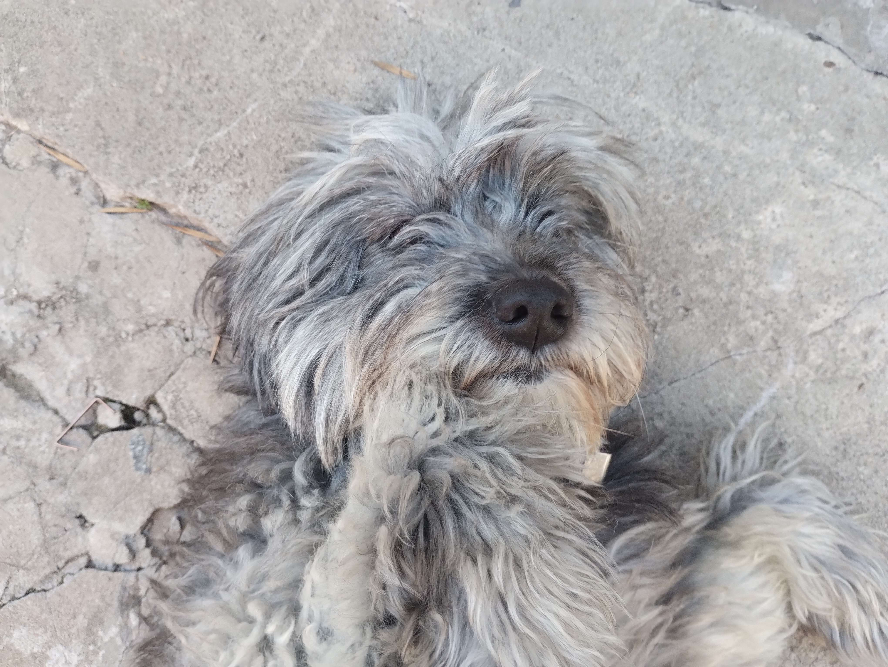

# Programación con objetos I
## Presentación Personal

### Datos Personales
- Mi nombre es: Mateo
- Mi Apellido es: Hortas
- Edad: 20
- Vivo en Ituzaingo

Hola, como ya habran leido me llamo Mateo, tengo 20 años, curse la secundaria en el colegio Americano y allí estudie economía con la cual me gradue y consegui el titulo para 2022, en 2023 me anote en la Unahur en la carrera de tecnicatura en programación para hoy en dia estar cursando esta materia.

### Información de mi cursada este cuatrimestre
- Este es mi primer contacto con github
- además de estar cursando progrmación con objetos 1, estoy cursando el taller de robotica
  
### Sobre mí
- El 5 de Marzo es mi cumpleaños 
- Tengo una perra llamada Lucy la cual tiene 9 años
 
- Diariamente voy al  gimnasio
 
- Me gusta las peliculas de acción y ciencia ficción
- Me gusta ver series entre ellas mis favoritas son Vikingos y Breaking Bad pero aún hay más que podria enumerar

  
